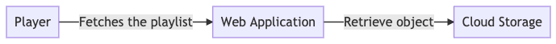

# Now Live - an open streaming platform

Have some fun streaming videos :-)

## What is this?

I created this project to experiment some video tools. Could this be an open streaming platform in the future? Yes.

Have you ever used live streaming tools like Youtube, Instagram and Facebook? There is a lot going on behing the scenes. 

*Now Live* assembles some of these tools together, creating a platform where people can stream their videos, packaging it for multiple devices using standard video formats.

To better understand the platform, we can reduce it in two parts: **producer** and **consumer**.

### Producer

Here we have a diagram representing all the necessary componentes to *produce* video resources.

### Consumer

And here we have another diagram, but now we represent the user consuming our streamings.

## How to use?

`make now-live` will build and run all the tools (packager, storage, frontend servers, etc).

`make ingest` produce and ingest a sample video so the packager can produce HLS playlists.

Now you can point your browser to http://localhost:8080/play and play the sample video.

### Components

#### Packager

...

#### Recorder

...

#### Storage

...

#### Web server

...